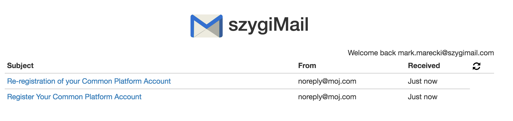
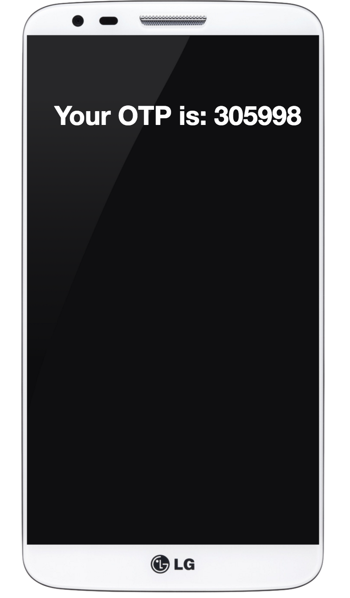

#Overview

It's a simple frontend app for ISG Email Stub.

It's able to extract OTP Notification, Password Reset, User registration, User Re-registration emails and present them in demo-able way :-) in a Web Browser.

There's a fake email client and fake mobile phone for that purposes.

###szygiMail

###phone client

#Dependencies

It's a node application so you need to install npm and all project dependencies first.

    cd szygiMail
    npm install

#Starting server

    PORT=80 npm start

If you're using mac or *nix system you can just execute go script (it'll install dependencies and everything)

    ./go

#URLs

Once application starts up it's available at these addresses:

Urls:

    http://localhost/email.html <- This simulates regular Email client
    http://localhost/mobile.html <- This is mobile phone simulator which reads only OTP Notification emails

Suggested approach is to add appropriate entries to /etc/hosts

    127.0.0.1 mymail.com mobilephone.com szygimail.com szygiphone.com

Then you can access the server via

    http://szygimail.com/email.html
    http://szygiphone.com/mobile.html

Which makes it even more real :-)

#Usage

Once you've started the server you can visit szygiMail by entering: http://localhost/email.html in your browser.

You will be asked to enter email address and password.

Email should match the user you created (or planning to create) in the system. Password can be anything (it's there just to make the client more real).

Once you've logged in you can browse the emails that were sent out by the system to this user. Just hit refresh icon (in the app, not browsers one) if you feel there should be something new.

Apart from that you can launch the mobile phone app by going to http://localhost/mobile.html. It will constantly check for new OTP code for the user you used to log in to the szygiMail.

If you want to change the username simply refresh szygiMail and you'll be again prompted for email/password.

#Configuration

All configurable elements sits in:

common/core.js

    module.exports = {
        getConfig: function () {
            return {
                idpEmailMockService: {
                    url: "http://10.124.107.11:8888"
                },
                httpClient: {
                    proxy: "http://10.224.23.8:3128"
                }
            }
        }
    }

To access those servers http client uses HaSS HTTP proxy. Disable it if you don't need it

#Technologies?

It's an expressjs application which offers simple rest interface to pull latest emails from ISG stub.

On the frontend it's an angular app which calls those REST Endpoints.

#Quirks

###Reset password email
ISG currently doesn't support different URLs for Registration/Reset-Password mails. It's using the same base URL which points to user registration in POA. To overcome this limitation on the backend side we fix the 'reset-password' email content by putting the right base URL.

This workaround is done for integration environment so if you plan to use it on PR1 remember to update it accordingly (and Email Stub IP of course)

###Registration email

There's an issue in ISG templating that if Full name of a user is too long the registration link gets malformed. Bas can provide more details if needed. Keep it short or introduce workaround like the one above.
